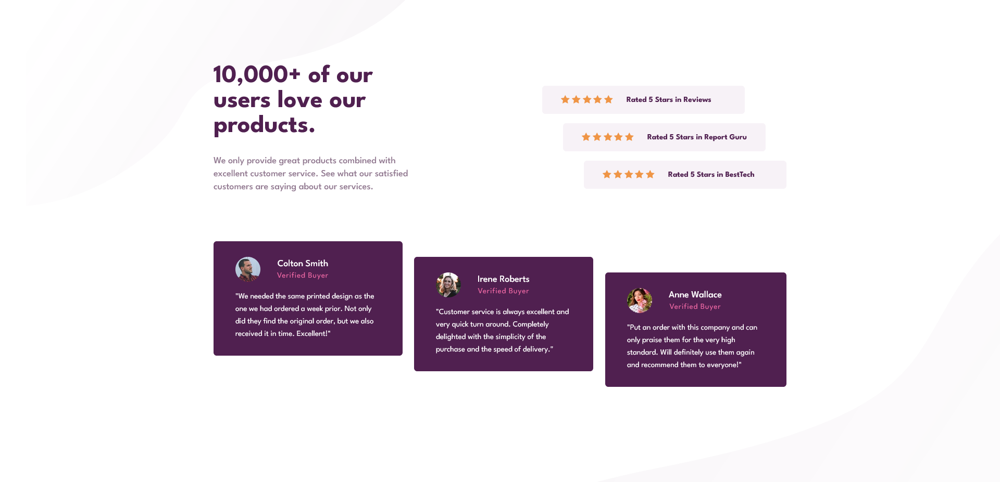

# Frontend Mentor - Social Proof Section Solution

This is a solution to the [Social proof section challenge on Frontend Mentor](https://www.frontendmentor.io/challenges/social-proof-section-6e0qTv_bA).

## Table of contents

- [Overview](#overview)
  - [The challenge](#the-challenge)
  - [Screenshot](#screenshot)
  - [Links](#links)
- [My process](#my-process)
  - [Built with](#built-with)
  - [What I learned](#what-i-learned)
  - [Continued development](#continued-development)
- [Author](#author)

## Overview

### The challenge

Users should be able to:

- View the optimal layout for the section depending on their device's screen size.

### Screenshot

### Links

- Solution URL: [GitHub](https://github.com/wesleyjacoby/Social-Proof-Section)
- Live Site URL: [GitHub Pages](https://your-live-site-url.com)

## My process

### Built with

- Semantic HTML5 markup
- CSS custom properties
- Flexbox

### What I learned

I found this challenge very difficult. The hardest part was deciding whether to use CSS Grid or Flexbox and then how to implement it for the mobile and desktop versions.

CSS Grid would have been perfect for the mobile design, but I wsn't sure how to implement it for the desktop version.

I ended up using Flexbox for both the mobile and desktop version.

### Continued development

I definitely need to do more challenges like this and experiment with maybe using both CSS Grid and Flexbox.

## Author

- Frontend Mentor - [@wesleyjacoby](https://www.frontendmentor.io/profile/wesleyjacoby)